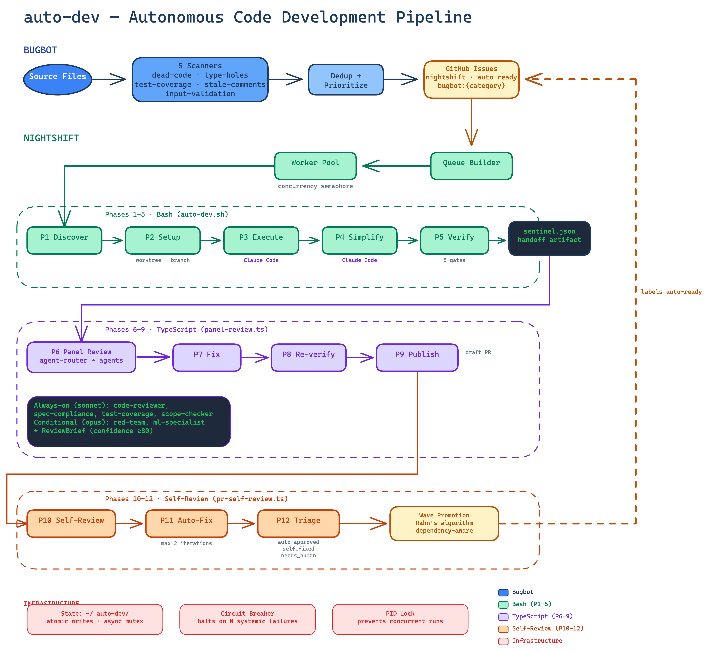

# auto-dev

Autonomous development pipeline that pairs with any GitHub-hosted TypeScript/Node repo. Three components work together: **bugbot** scans the codebase for issues and files them on GitHub, **nightshift** picks them up and implements fixes autonomously using Claude Code, and **self-review** triages its own PRs before you see them.

> **Note:** Currently TypeScript-only. The verification gates (`npm run verify`, dependency guard, etc.) assume a Node/TS project. Supporting other languages would require swappable verify commands and language-aware guardrails.

## Prerequisites

- Node.js 18+
- [GitHub CLI](https://cli.github.com/) (`gh`) — authenticated
- [Claude Code CLI](https://docs.anthropic.com/en/docs/claude-code) (`claude`) — authenticated
- **Claude Max subscription recommended** — nightshift and bugbot run headless Claude Code sessions that consume significant tokens. Built and tested with unlimited Max tokens; API billing may be expensive for large queues.
- **GitHub Actions minutes** — every PR nightshift creates triggers CI on the target repo (branch push + merge-to-main = 2 CI triggers per issue). The actual cost depends on your target repo's CI workflow — matrix builds, long test suites, or multiple jobs multiply the minutes per trigger. A full overnight run of 40+ issues can easily consume 200+ minutes on a modest CI setup, and much more with heavier workflows. GitHub Free includes 2,000 min/month for private repos (public repos are unlimited). Monitor usage at Settings → Billing → Actions, and set a $0 spending limit to avoid surprise charges. Consider pausing nightshift late in your billing cycle if you're above 80%.
- `npx tsx` (included with Node 18+)
- tmux (for `nightshift start`)

## Architecture



The diagram uses color-coded swim lanes:
- **Blue** — Bugbot: scanners, dedup, and issue filing
- **Green** — Bash phases (P1–P5): worktree setup and execution via `auto-dev.sh`
- **Purple** — TypeScript phases (P6–P9): panel review and publish via `worker.ts`
- **Orange** — Self-review phases (P10–P12): PR triage via `pr-self-review.ts`
- **Red (bottom bar)** — Infrastructure: state management, circuit breaker, PID lock

Dashed arrows represent label transitions and feedback loops (see [Label Lifecycle](#label-lifecycle)).

See the [interactive pipeline explainer](https://tropic-lodge-2sy6.here.now/) for a visual breakdown ([source](docs/pipeline-explainer.html)).

## Setup

```bash
git clone <this-repo-url>
cd auto-dev
npm install
cp .env.example .env   # edit TARGET_REPO to point at your project
```

Add the CLI functions to your shell:

```bash
echo 'source /path/to/auto-dev/nightshift/nightshift.zsh' >> ~/.zshrc
```

If you clone to a non-standard location, set `AUTO_DEV_REPO` to the repo root:

```bash
export AUTO_DEV_REPO=~/projects/auto-dev  # default: ~/Repos/auto-dev
```

## Usage

### Bugbot (scan + file issues)

```bash
bugbot                    # Run all scanners against TARGET_REPO
bugbot --dry-run          # Show findings without filing issues
bugbot --category dead-code  # Run specific scanner only
```

### Nightshift (autonomous implementation)

```bash
nightshift start                    # Launch in tmux with dashboard
nightshift start --at 2:00          # Start at 2:00 AM tonight (sleeps in tmux)
nightshift start --in 1h            # Start in 1 hour
nightshift start --fresh            # Ignore prior state, start clean
nightshift start --issue 184,185    # Process specific issues (comma-separated, passed individually to auto-dev.sh)
nightshift start --concurrency 3    # Parallel workers
nightshift start --dry-run          # Preview queue without executing
nightshift start --max-failures 3   # Stop after N consecutive failures
nightshift status                   # One-shot status check
nightshift log                      # Tail $STATE_DIR/nightshift.log
nightshift stop                     # Kill the tmux session (also cancels scheduled runs)
nightshift promote                  # Label next wave of unblocked issues
```

Flags can be combined: `nightshift start --at 2:00 --concurrency 2 --fresh`

The queue builder converts labeled GitHub issues into a prioritized work queue; the worker pool processes them with configurable concurrency (`--concurrency N`) controlled by a semaphore.

### Optimize (autonomous performance tuning)

```bash
nightshift optimize                          # Run with defaults (10 experiments, PR after 5 wins)
nightshift optimize --max-experiments 20     # Cap experiment count
nightshift optimize --wins-before-pr 3       # Draft PR after 3 wins
nightshift optimize --dry-run                # Show config without executing
nightshift optimize status                   # Show optimize state
```

Inspired by Karpathy's [autoresearch](https://github.com/karpathy/autoresearch) pattern. Runs in a **git worktree** (`TARGET_REPO--optimize`) so the user's working tree is never touched. Each experiment cycle:

1. Claude generates a hypothesis (reads `program.md` + prior results)
2. Claude implements the change headlessly
3. `npm run verify` gates correctness (build + lint + test)
4. Benchmark runs 15 diverse screenings, measures p50/p95 latency
5. **Win detection** requires both >=5% p50 improvement AND statistical significance (paired t-test, alpha=0.05)
6. Win → commit kept, baseline ratchets forward. Loss → rollback to snapshot SHA

After N wins accumulate, a draft PR is created with before/after metrics. Wall time is ~5 minutes per experiment.

## Pipeline Phases

| Phase | Name | Tool | Description |
|-------|------|------|-------------|
| 1 | Discover | auto-dev.sh | Find `nightshift`-labeled issues via `gh` |
| 2 | Setup | auto-dev.sh | Create git worktree from `origin/main` |
| 3 | Execute | auto-dev.sh | Claude Code implements the fix headlessly + scope constraints (no cascade deletions) |
| 4 | Simplify | auto-dev.sh | Code quality pass (Claude reviews own work) + scope-limited (won't delete code the spec didn't mention) |
| 5 | Verify | auto-dev.sh | Gates 1–5: verify, file limits (≤15), line limits (≤500 total), dependency guard (positive-verb match), deletion budget (≤15 net / ≤40 gross). On success, writes `sentinel.json` — the handoff artifact (with `net_deletions`, `head_sha`) that activates the TypeScript layer |
| 6 | Panel Review | worker.ts | Always: code-reviewer, spec-compliance-checker, test-coverage-checker, scope-checker. Conditional: red-team (security files), ml-specialist (scoring files) |
| 6.5 | Simplify Filter | worker.ts | Remove overengineered review suggestions (internal step, not shown in diagram) |
| 7 | Fix | worker.ts | Apply actionable review findings |
| 8 | Re-verify | worker.ts | `npm run verify` after fixes |
| 9 | Publish | worker.ts | Create draft PR, post review brief |
| 10 | Self-Review | pr-self-review.ts | Review each PR diff, classify findings |
| 11 | Auto-Fix | pr-self-review.ts | Fix auto-fixable findings, re-verify, push |
| 12 | Triage | pr-self-review.ts | Deterministic: approve / self-fix / flag for human |
| 12+ | Wave Promotion | pr-self-review.ts | Promotes dependency-unblocked issues (Kahn's algorithm), labels them `auto-ready` + `nightshift` to re-enter the queue |

## Configuration

| Variable | Default | Description |
|----------|---------|-------------|
| `TARGET_REPO` | `~/Repos/your-target-repo` | Repository to scan and process |
| `STATE_DIR` | `~/.auto-dev` | Nightshift state, logs, and run artifacts |
| `BUGBOT_STATE` | `~/.bugbot` | Bugbot state directory |
| `SCAN_ROOT` | Same as `TARGET_REPO` | Bugbot scan target (if different) |
| `BUGBOT_ROOT` | `~/Repos/auto-dev/bugbot` | Bugbot source directory |

The circuit breaker (`--max-failures N`, default 3) halts the queue after N consecutive systemic failures (crashes, timeouts, setup errors). Spec-level failures (verify gate, panel review) reset the counter. A PID lock at `$STATE_DIR/nightshift.pid` prevents overlapping runs.

## Wave Promotion

Nightshift includes a dependency-aware promoter (`nightshift promote`) that uses Kahn's algorithm to find issues whose dependencies are all satisfied (closed or PR-ready). Promotion uses an **allowlist** approach: only issues whose labels are all in the `AUTONOMOUS_LABELS` set get promoted. Any unknown label blocks promotion (fails safe). When promotion succeeds, issues are labeled `auto-ready` + `nightshift`, re-entering the queue for the next nightshift run. This creates the self-sustaining feedback loop shown as the dashed arrow in the diagram.

## Label Lifecycle

```
[bugbot files issue]
    → adds: auto-ready + nightshift + bugbot + bugbot:{category} + priority:{level}
        → [nightshift picks up]
            → removes: auto-ready + nightshift
            → [success] adds: auto-pr-ready (draft PR created)
            → [no changes] issue closed with comment (no label added)
            → [failure] adds: auto-failed
```

- `nightshift` — scoped for autonomous processing
- `auto-ready` — specced and ready (broader gate)
- `auto-pr-ready` — PR created, awaiting human merge
- `auto-failed` — pipeline failed, needs investigation
- `bugbot` — filed by bugbot (vs. manually created)
- `bugbot:{category}` — scanner category (e.g., `bugbot:dead-code`, `bugbot:type-holes`)
- `priority:{level}` — severity-based priority (e.g., `priority:high`, `priority:low`)

### Promotion Allowlist

The wave promoter only promotes issues whose labels are **all** in the autonomous-compatible set. Labels outside this set block promotion (unknown labels fail safe).

**Compatible labels:** `bug`, `enhancement`, `documentation`, `frontend`, `pipeline`, `extraction`, `dir:*`, `tier:*`, `priority:*`, `bugbot`, `bugbot:*`, `nightshift`, `auto-ready`, `auto-pr-ready`, `auto-failed`, `auto-review-failed`

**Blocked by default:** `research`, `design`, `admin`, `in-progress`, `blocked`, and any label not in the set above. To make a new label autonomous-compatible, add it to `AUTONOMOUS_LABELS` in `nightshift/src/promoter.ts`.
